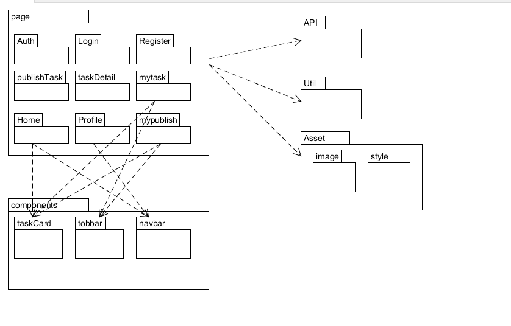
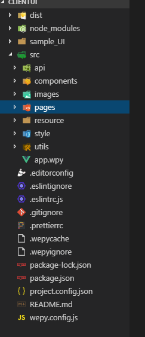
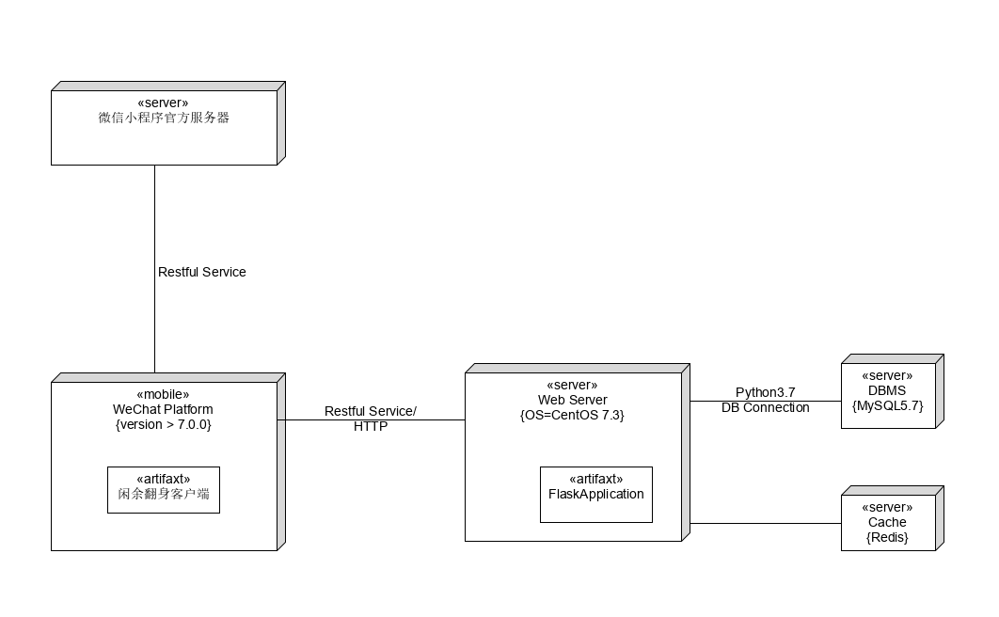

# 软件设计文档 (SD)

    注：闲余翻身微信小程序同时也是该小组成员在 2019 年春季学期中山大学系统分析与设计课程的大作业。按照本课程作业要求在 SD 文档开头点明。

## 1. Client

### 1.1 技术选型及理由

**微信小程序框架**

我们选择了微信小程序开发框架作为前端框架。

- 小程序框架提供了自己的视图层描述语言 WXML 和 WXSS，以及基于 JavaScript 的逻辑层框架，容易上手；
- 在视图层与逻辑层间提供了数据传输和事件系统，支持响应式、双向数据绑定等特性，可以让数据与视图非常简单地保持同步：当做数据修改的时候，只需要在逻辑层修改数据，视图层就会做相应的更新，因而能够很好地支持丰富的用户交互体验支持，可以让开发者方便的聚焦于数据与逻辑上；
- 框架还管理了整个小程序的页面路由，可以做到页面间的无缝切换，并给以页面完整的生命周期，开发者需要做的只是将页面的数据，方法，生命周期函数注册进框架中，其他的一切复杂的操作都交由框架处理；
- 此外，框架还提供了微信风格的组件和丰富的api，实现了尽量以简单、高效的方式让开发者可以在微信中开发具有原生 APP 体验的服务。
- 4g网络和移动支付的普及推动了微信小程序作为互联网应用的发展，使用微信小程序对用户更加快捷和便利。

基于以上理由，选择微信小程序作为前端框架对用户和开发者都十分友好。

#### 1.2 架构设计

**wepy框架**

wepy框架是腾讯官方推出的小程序开发框架，开发风格接近于 Vue.js，支持组件 Props 传值，自定义事件、组件分布式复用Mixin、计算属性函数computed、模板内容分发slot等等。支持组件化开发，完美解决组件隔离，组件嵌套，组件通信等问题，组件通信等问题，支持使用第三方 npm 资源，自动处理 npm 资源之间的依赖关系，完美兼容所有无平台依赖的 npm 资源包，通过 polyfill 让小程序完美支持 Promise，解决回调烦恼，可使用Generator Function / Class / Async Function 等特性，大大提升开发效率。框架对小程序本身进行了优化，如请求列对处理，优雅的事件处理，生命周期的补充，性能的优化等等，支持样式编译器：Less/Sass/Styus，模板编译器：wx-ml/Pug，代码编译器：Babel/Typescript。

**wepy项目目录结构**

```
├── dist                   小程序运行代码目录（该目录由WePY的build指令自动编译生成，请不要直接修改该目录下的文件）
├── node_modules           
├── src                    代码编写的目录（该目录为使用WePY后的开发目录）
|   ├── components         WePY组件目录（组件不属于完整页面，仅供完整页面或其他组件引用）
|   |   ├── com_a.wpy      可复用的WePY组件a
|   |   └── com_b.wpy      可复用的WePY组件b
|   ├── pages              WePY页面目录（属于完整页面）
|   |   ├── index.wpy      index页面（经build后，会在dist目录下的pages目录生成index.js、index.json、index.wxml和index.wxss文件）
|   |   └── other.wpy      other页面（经build后，会在dist目录下的pages目录生成other.js、other.json、other.wxml和other.wxss文件）
|   └── app.wpy            小程序配置项（全局数据、样式、声明钩子等；经build后，会在dist目录下生成app.js、app.json和app.wxss文件）
└── package.json           项目的package配置
```

一个page或者component包含:

| 脚本部分 | `<script></script>`标签中的内容 | 对应原生.js文件和.json文件 |
| -------- | ------------------------------- | -------------------------- |
| 结构部分 | `<template></template>`模板部分 | 对应于原生的`.wxml`文件    |
| 样式部分 | `<style></style>`样式部分       | 对应于原生的`.wxss`文件    |

**wepy的编译过程如下**


#### 1.3 模块划分

根据业务逻辑和UI设计图，将项目前端分为多个模块，按照wepy开发标准，每个页面对应pages目录下一个.wpy文件

主要页面模块包括：

* **授权** ：用户对小程序进行授权，小程序获取用户的部分微信个人信息，包括昵称头像，地区等。
* **登录模块**：用户输入对应的邮箱以及密码登录小程序
* **注册模块**：用户输入中大邮箱或QQ邮箱，进行注册并验证，在邮箱中获取验证码之后，完善其余注册信息。
* **任务列表模块**：用户获取当前可接受任务的列表
* **发布任务模块**：用户发布任务，填写相关标题、描述、人数、报酬、以及图片描述等信息，当前可发布问卷、取快递、其他三种类型。
* **个人信息模块**：用户个人信息管理模块，实现用户个人信息的修改与查看。
* **我的任务模块**：用户接受的所有任务的管理
* **我的发布模块**：用户发布的所有任务的管理
* **任务详情模块**：任务的详细信息显示

此外，还定义了三个组件，构成组件模块。三个组件包括

* 任务卡片组件，主要封装了任务简单信息的样式结构和交互事件
* topbar组件，顶部导航栏组件
* navbar组件，底部导航栏组件

为了是样式个美观，还是用了一些样式库和组件库，如`weui`，`iview`

加上小程序的全局文件，构成app模块； 还有资源文件，包括图片，构成资源模块； 最后还有小程序的工具配置模块，和公共代码模块，api模块用于请求数据，各个模块关系如下：



最终目录结构:



其中src目录具体结构如下

    ├── src
        ├── app.wpy                 //入口文件
        ├── api                     //api接口
        |   ├── index.js            // api的index文件
        |   ├── task.js             // 任务相关的api连接函数
        |   ├── user.js             // 用户相关的api连接函数
        ├── components              //自定义组件
        |   ├── questionitem.wpy    // 问卷中问题组件
        |   ├── topbar.wpy          // 顶部导航栏组件
        |   ├── taskcard.wpy        // 任务卡片组件
        ├── images                  //图片文件夹
        ├── pages                   //页面
        │   ├── answerquestion.wpy  //问卷回答
        │   ├── authorize.wpy       //授权页面
        │   ├── completetask.wpy    //完成任务
        │   ├── createtask.wpy      //创建任务
        |   ├── detail.wpy          //任务详情页面
        |   ├── edit-user-info.wpy  //用户信息修改界面
        |   ├── favorite.wpy        //收藏界面  
        |   ├── home.wpy            //主界面
        |   ├── login.wpy           //登录页面
        |   ├── message.wpy         //消息页面
        |   ├── mypublish.wpy       //我发布的页面
        |   ├── mytask.wpy          //我的任务
        |   ├── point.wpy           //积分信息显示
        |   ├── profile.wpy         //我页面
        |   ├── question.wpy        //问卷发布页面
        |   ├── recharge.wpy        //充值页面
        |   ├── register.wpy        //注册页面
        |   ├── search.wpy          //搜索页面
        |   ├── setpass.wpy         //修改密码
        |   ├── userinfo.wpy        //修改个人信息
        ├── resource                //资源文件
        │   ├── iview               //iview组件
        ├── style                   //样式
        │   ├── weui.wxss           //weui样式文件
        │   ├── icon.less           //icon样式文件
        ├── utils                   //工具包
        │   ├── contant.js          //缓存常量定义文件    
    ├── package.json                //配置文件
    ├── wepy.config.js              //配置文件   

#### 1.1.4 软件设计技术

**MVVM设计模式**

MVVM的全称为Model-View-ViewModel，M表示Model，V表示视图View，VM表示数据与模型，当前端View变化时，由于View与VM进行了绑定，VM又与M进行交互，从而使M得到了改变；当M发生变化时，小程序检测到变化并通知VM，由于VM和V进行了绑定，因此V得到改变。

wepy内的设计思想就包含了MVVM，因此小程序内页面和组件模块都自动采用了MVVM设计模式。

## 2. Server

### 2.1 技术选型理由

**后台主要的技术是: Python Flask + MySql 完全 Docker 化**，使用理由

1. **Python Flask**
    * Python的框架基本都是简单容易，能迅速上手，并实现快速开发，而Flask相比于其他Python内部的服务器框架，更为轻量、处理异步事件更为容易，而且更受欢迎、社区维护更加持续，社区更为活跃。
    * Flask配套的有很多方便的框架，比如吸收了另一个非常有名的Python ORM框架SqlAlchemy的Flask-SqlAlchemy，又或者另一个文件上传的框架Flask-Uploads。使用这样成熟的框架，可以提供更佳的鲁棒性和便利性。
    * 相比于其他的可以作为后台的语言(Java/Nodejs)等，Python的学习成本更低，而且队伍里组员对Python更为熟悉。
2. **MySql**
    * 免费。
    * 非常成熟，非常受欢迎，更新频繁，社区活跃，这些都表现了MySQL的生命力。
    * 组员对MySQL的了解更为深入。
3. **Docker**
    * 和宿主机环境高度分离
    * 简化部署流程
    * 可扩展性高
    * 业界主流

### 2.2 架构设计

整体是著名的 <strong>Client-Server(CS)</strong>架构。结构图如下：



### 2.3 模块划分

模块划分上是基于MVC模式的，其中V(View)这一模块属于前端，就不在这里表示了，而MC这两块，即Model和Controller两块则在下图中的db和responses中。

```
│  app.py				主程序入口
│  config.py				flask与MySQL配置
│  constants.py				常量文件
│  README.md				文档
│  requirements.txt			记录所有依赖包及其精确的版本号，以便新环境部署。
│  secret_key.py			邮件服务器的密钥
│  
├─assets				文档图片文件夹
│      
├─db					数据库操作文件夹
│  │  Accept.py				Accept表
│  │  Answer.py				Answer表
│  │  DbHelper.py			集成的数据库操作文件
│  │  Organization.py			Organization表
│  │  prepare.py			预处理函数文件
│  │  Problem.py			Problem表
│  │  Student.py			Student表
│  │  Task.py				Task表
│  │  test.py				数据库测试文件
│  │  __init__.py
│  │  
│  └─__pycache__			pyc中间文件夹
│          
├─images				用户上传的文件夹
│      
├─responses				响应函数
│  │  my.py				个人信息文件
│  │  task.py				任务相关操作文件
│  │  user.py				用户操作文件
│  │  __init__.py
│  │  测试样例.md
│  │  
│  └─__pycache__			pyc中间文件夹
│          
├─tools
│  │  utils.py				工具类
│  │  
│  ├─templates
│  │      email.html		        邮件模板
│  │      
│  └─__pycache__			pyc中间文件夹
│        
└─__pycache__				pyc中间文件夹
```

* 所有数据操作相关的部分都放到了db中，包括数据层和服务层
    * 因为使用了可以对对象操作而直接操作数据库的ORM，所以数据层很简单，只是各个信息的结构类而已。具体的类包括
        * Student: 表示学生实体的类，主要包括学生的id、email、password以及其他的一些次要信息(如name、sex等)。这里的学生可以充当任务发布者和任务接收者。
        * Organization: 表示组织实体的类，主要包括组织的id、email、password以及其他信息。充当任务发布者的角色。
        * Task: 表示任务实体的类。里面包含任务的内容、标题等信息。
        * Accept: 表示接受实体的类。如果一个学生接受了一个任务，就会有一个Accept将该学生与该Task关联起来。里面包含任务接受的时间等信息。
        * Problem: 表示任务关联的Problem，只要Task表示一个问卷，那么Problem就可以与Task关联起来，这个不是硬性要求，需要程序符合规范，是扩充的一部分，主要包含问题的内容与所有答案。
        * Answer: 表示答案，与Problem以及Accept关联起来，包含答案主体。
    * 服务层则封装了所有逻辑上对数据层进行的操作，只有一个文件，那就是DbHelper，用于方便操作数据。
* responses中就是Controller层了，通过http/https这些网络协议获取从View中发送过来的请求，然后操作Model，获取响应数据后将这些返回给View。
* 其余模块
    * 其实主要就是tools里的utils了，里面有一些常用的通用操作。
    * 还有一些顶层文件，如config.py、app.py，这些是全模块共享的，作为多模块通信的基础。

### 2.4 软件设计技术

#### 2.4.1 面向对象编程

从上面的各个实体结构类可以看出，我们项目的后台逻辑层部分，将数据库模型中的每一张表的操作分别封装成一个类，实现面向对象，使得逻辑层对表进行操作时，无需考虑 sql 语句，只需调用类中所提供的增删改查操作，即可完成对于数据库的操作。

之后的服务层将所有操作封装起来，将数据层与Controller解耦，大部分修改都在DbHelper中进行即可。DbHelper的结构大致如下:

```
DbHelper
    初始化: 建表等操作
        __init__
        delete_db
        initial_data
    基本的增删改查
        save
        save_all
        delete
        delete_all
        commit
        update_student_or_organization
    登录注册相关
        sign_in_true
        sign_up_true
    任务的相关操作
        create_task
        has_accept
        accept_task
        cancel_task
        finish_task
        get_all_publish_tasks
        get_ongoing_publish_tasks
        get_finished_publish_tasks
        get_all_accept_tasks
        get_ongoing_accept_tasks
        get_finished_accept_tasks
        get_complete_accept_tasks
        get_recipient  查找任务的接收者
        get_publisher  查找任务的发布者
        get_all_problems
        post_answer
        get_all_answers
        get_answers
        get_task_by_id
        get_task
        get_task_by_text
        get_task_by_tag
    学生/组织实体的查询
        query_student
        query_oraganization
    报酬系统
        charge
        carry_over
        cash_in
```

#### 2.4.2 一些简单的技巧

1. 使用了Python中一些简单的反射技巧，使得在json化各个实体对象的时候，可以只要几个简单的方法就可以决定各个对象需要传输的属性。这样的自定义可以使得json化更灵活，而且传输的数据也更少，占用的带宽更少。

2. 更多的可配置选项，在Config.py中只要修改几行再重启一下就可以令后台变化，虽然不算得上是非常高大上的技术，但这些集中配置的选项，可以简化需求变更时的操作，但令人遗憾的是还没有实现动态配置，以后如果有时间就可以实现一下。

#### 2.4.3 Service Oriented Architecture through Dockerize

Service Oriented Architecture 需要达到可重复使用, 粒度, 模块性, 可组合型, 对象化原件, 构件化以及具交互操作性，这些通过 docker 化来实现。

通过容器化部署方案，可以使得各容器内的环境分离开来，减少了代码环境强耦合的影响。同时可以使得每个容器各自安装的依赖最小化，极大地节约了宿主机的存储资源。
