# 软件需求规格说明书
<!-- TOC -->

- [软件需求规格说明书](#软件需求规格说明书)
    - [1、引言](#1引言)
        - [1.1、目的](#11目的)
        - [1.2、背景](#12背景)
        - [1.3、定义](#13定义)
        - [1.4、参考资料](#14参考资料)
    - [2、任务概述](#2任务概述)
        - [2.1、目标](#21目标)
        - [2.2、功能需求](#22功能需求)
            - [2.2.1、用例图](#221用例图)
            - [2.2.2、活动图](#222活动图)
                - [Use Case 1 注册登录](#use-case-1-注册登录)
                - [Use Case 2 查看平台任务](#use-case-2-查看平台任务)
                - [Use Case 3 发布任务](#use-case-3-发布任务)
                - [Use Case 4 查看历史任务](#use-case-4-查看历史任务)
                - [Use Case 5 查看修改个人信息](#use-case-5-查看修改个人信息)
            - [2.2.3、领域模型](#223领域模型)
            - [2.2.4、状态模型](#224状态模型)
            - [2.2.5、功能模型](#225功能模型)
                - [基本功能](#基本功能)
                - [系统顺序图](#系统顺序图)
                    - [发布任务（多类型）](#发布任务多类型)
                    - [获取与浏览任务列表](#获取与浏览任务列表)
                    - [查看任务详细信息](#查看任务详细信息)
                    - [领取任务](#领取任务)
                    - [完成任务（提交验证信息）](#完成任务提交验证信息)
                    - [查看与统计问卷详情](#查看与统计问卷详情)
        - [2.3、用户特点](#23用户特点)
        - [2.4、假定与约束](#24假定与约束)
            - [时间约束](#时间约束)
            - [实现约束](#实现约束)
            - [法律约束](#法律约束)
    - [3、需求规定](#3需求规定)
        - [3.1、对功能的规定](#31对功能的规定)
        - [3.2、对性能的规定](#32对性能的规定)
            - [3.2.1、精度](#321精度)
            - [3.2.2、时间特性要求](#322时间特性要求)
            - [3.2.3、灵活性](#323灵活性)
        - [3.3其他专门要求](#33其他专门要求)
            - [3.3.1、可维护性](#331可维护性)
            - [3.3.2、可扩展性](#332可扩展性)
            - [3.3.3、易读性](#333易读性)
            - [3.3.4 可用性](#334-可用性)
            - [3.3.5、可靠性](#335可靠性)
            - [3.3.6、安全性](#336安全性)
            - [3.3.7、可适应性](#337可适应性)
            - [3.3.8、故障处理](#338故障处理)
    - [4、运行环境](#4运行环境)
        - [4.1、设备](#41设备)
        - [4.2、支持软件](#42支持软件)

<!-- /TOC -->
## 1、引言
### 1.1、目的

本文档将描述项目的各项功能需求、性能需求，阐述项目背景及范围等总体结构和功能结构，便于项目团队成员更好地了解项目情况， 使项目工作开展的各个过程合理有序，也便于用户与开发成员进行沟通交流。

### 1.2、背景

每逢毕业季或者一些比赛的时候，便可以在微信群中看到大量的问卷以及红包作为奖赏，另外大学生的取快递区域较为集中而且有时间限制，同时离一部分住宿的区域比较远，所以可以代拿快递，另外还有取外卖、图书馆学习等求助、互助、有偿的行为的存在。同时还有一些组织需要进行宣传活动等，以及志愿者活动等等。除此之外，由于学校的一些规定和措施，或者自己时间的问题，拿外卖和取快递有时也会有一定的困难。所以我们希望为这些有困难的同学提供帮助，并为一些有空闲的同学提供挣钱的简单渠道。

### 1.3、定义

闲鱼翻身表示我们课程项目所设计的系统

### 1.4、参考资料

[1] GB856T——88，软件设计文档国家标准—软件需求说明书

## 2、任务概述
### 2.1、目标

我们希望能够开发出基于微信小程序的应用程序，打造一款广泛使用的手机接单的手机挣闲钱的微信小程序，为有困难的同学提供及时的帮助，为有时间的同学提供赚钱的渠道。

我们期望打造出的产品具有如下特性：
* 注册和登录使用学校的邮箱进行，保证用户的真实性
* 可以通过邮箱的类型来区分账户的类型
* 发布者可以发布问卷或取快递的任务
* 接收者接收任务后需要立即完成，完成后收到相应的回报
* 可以利用tag，将任务推送给对应的用户，以提高任务完成的质量。如：问卷限制非心理学院学生，则任务不会推送给心理学院学生
* 利用微信小程序进行交互，不用下载额外的应用软件，操作简单便捷
* 利用邮箱进行实名制，组织账号需要向平台提交申请，增加了可靠性
* UI设计简单美观

### 2.2、功能需求

#### 2.2.1、用例图

下面为整个系统的用例图

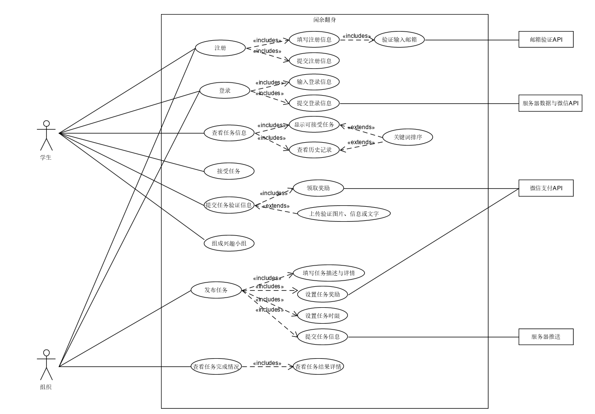

#### 2.2.2、活动图

##### Use Case 1 注册登录
- **用例图**

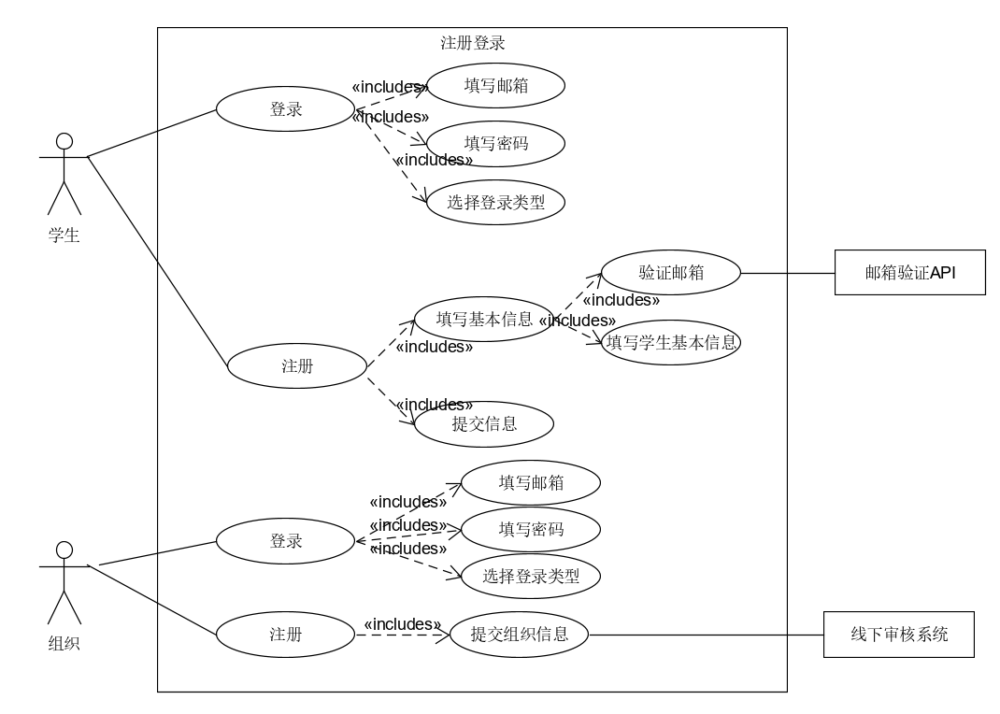
- **基本用例**
  
    - 学生注册：填写基本信息，提交注册信息
    - 学生登录：填写邮箱、填写密码、选择登录类型为学生
    - 组织登录： 填写邮箱、填写密码、选择登录类型为学生
    - 组织注册： 提交组织信息

- **选作用例**：忘记密码，通过邮箱重置密码
- **用例名称**：组织/学生注册与登录
- **用例范围**：小程序端
- **用例级别**：用户目标
- **参与者**：组织与学生
- **前置条件**：小程序在微信中打开，并且保证网络通畅，小程序开启调试模式
- **后置条件**：组织用户输入信息完全可靠可信
- **流程**

    - 学生注册，填写对应的学生基本信息，填写邮箱并点击验证邮箱，获得邮箱验证码，提交注册信息
    - 学生注册完成之后，自动登录
    - 学生登录，学生填写对应的邮箱以及密码，选择登录类型为学生，点击登录按钮，验证通过后进入主页面。
- **流程图**

    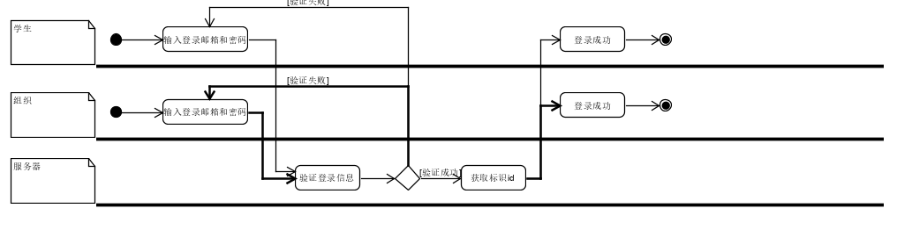
    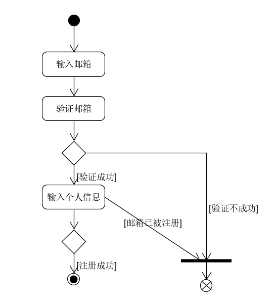
##### Use Case 2 查看平台任务
- **用例图**

    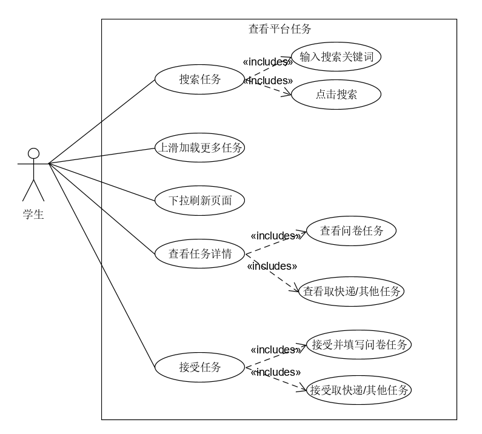
- **基本用例**
  
    - 搜索任务：输入搜索的关键词，可以得到对应的任务
    - 上滑加载更多任务：界面一次显示10个任务，下滑加载更多
    - 下拉刷新页面： 界面下拉，得到刷新
    - 查看任务详情：点击任务查看任务详细信息
    - 接受任务：接受非问卷任务，接受问卷任务并提交问卷答案

- **选作用例**：按用户喜好推荐任务：每个用户系统会根据填写的信息，喜好等推荐不同的任务
- **用例名称**：查看平台任务
- **用例范围**：小程序端
- **用例级别**：用户目标
- **参与者**：学生
- **前置条件**：已成功登录
- **后置条件**
- **流程**

    - 搜索任务：用户根据自己的喜好输入关键字，点击搜索按钮搜索对应的任务，并选择
    - 上滑加载、下拉刷新： 用户根据自己的喜好挑选对应的任务
    - 查看任务详情：点击感兴趣的任务，查看详情
    - 接受任务：点击接受任务按钮，若为问卷，则先填完对应的问卷在接受并提交，否则直接接受。
- **流程图**

    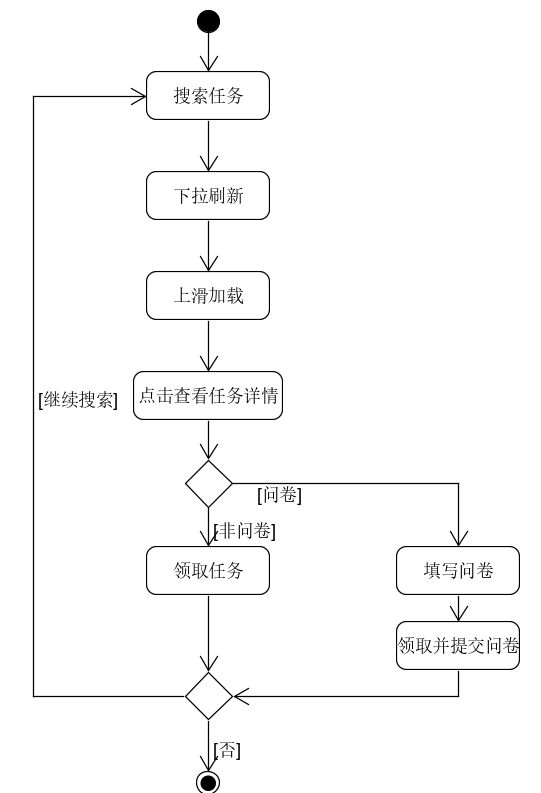
##### Use Case 3 发布任务
- **用例图**

    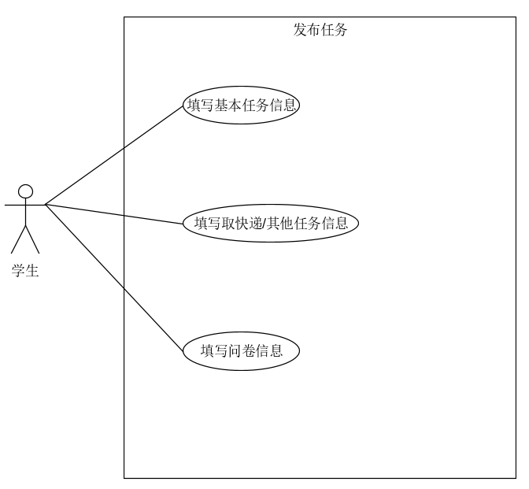
- **基本用例**
  
    - 填写基本任务信息：输入搜索的关键词，可以得到对应的任务
    - 填写取快递/其他任务信息：界面一次显示10个任务，下滑加载更多
    - 填写问卷信息： 界面下拉，得到刷新
- **选作用例**

    - 指定任务接受对象：指定可以接收和完成任务接受的对象
- **用例名称**：查看平台任务
- **用例范围**：小程序端
- **用例级别**：用户目标
- **参与者**：学生
- **前置条件**：已成功登录
- **后置条件**
- **流程**
    - 填写基本任务信息
    - 选择任务类型: 选择问卷或取快递或其他
    - 填写对应任务类型的信息
- **流程图**

    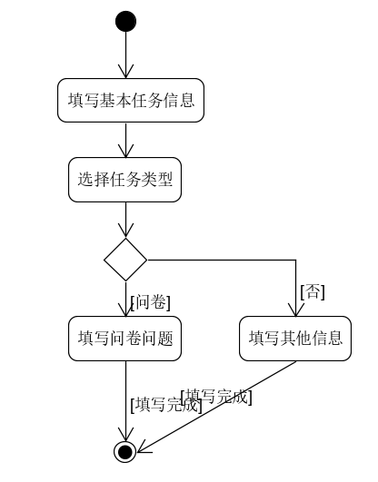
##### Use Case 4 查看历史任务
- **用例图**

    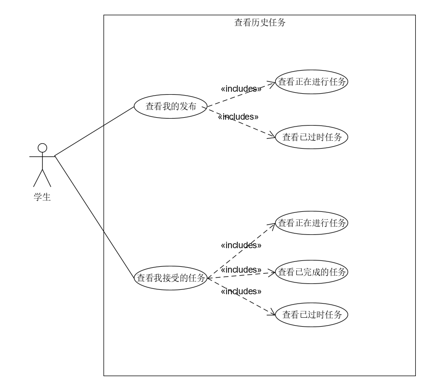
- **基本用例**
  
    - 查看我的发布任务：查看我发布的任务中正在进行与已过时的任务
    - 查看我接收的任务：查看我接收的任务中正在进行与已过时与已完成的任务
- **选作用例**
- **用例名称**：查看平台任务
- **用例范围**：小程序端
- **用例级别**：用户目标
- **参与者**：学生
- **前置条件**：已成功登录
- **后置条件**
- **流程**
- **流程图**
##### Use Case 5 查看修改个人信息
- **用例图**

    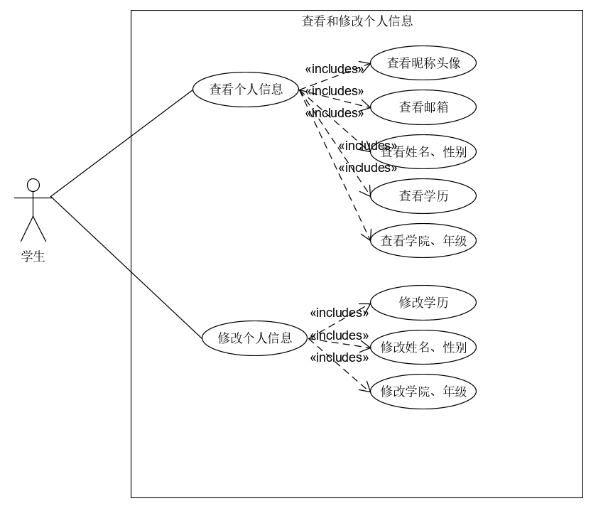
- **基本用例**
  
    - 查看个人信息：查看我的信息，包括姓名、性别、年级、学院、学历等
    - 修改个人信息：修改我的信息，包括姓名、性别、年级、学院、学历等
- **选作用例**
- **用例名称**：查看平台任务
- **用例范围**：小程序端
- **用例级别**：用户目标
- **参与者**：学生
- **前置条件**：已成功登录
- **后置条件**
- **流程**：选择对应的信息，修改即可
- **流程图**

#### 2.2.3、领域模型

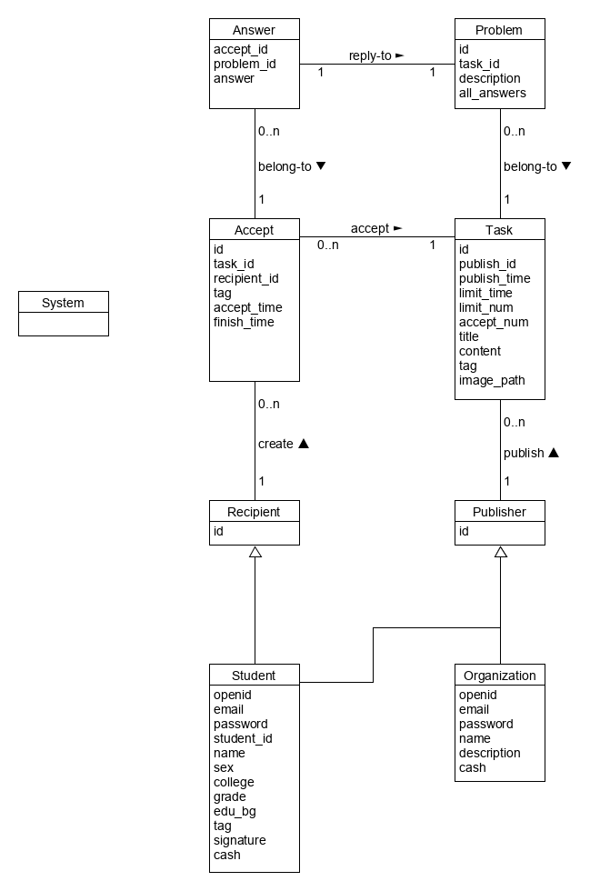

#### 2.2.4、状态模型

Task对象从创建任务到任务结束的状态图：
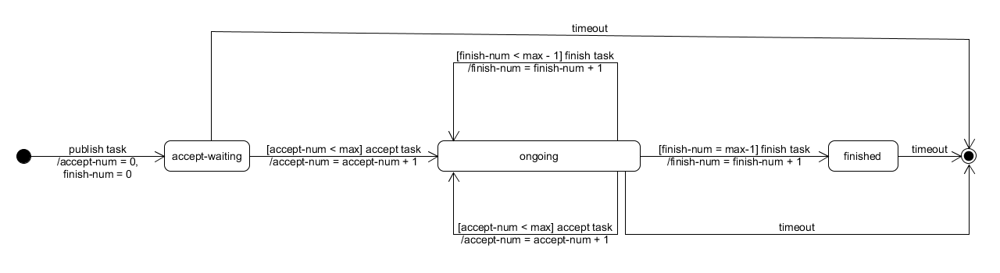

#### 2.2.5、功能模型

##### 基本功能

1. 发布任务（多类型）
2. 获取与浏览任务列表
3. 查看任务详细信息
4. 领取任务
5. 完成任务（提交验证信息）
6. 查看与统计问卷详情

##### 系统顺序图

###### 发布任务（多类型）

###### 获取与浏览任务列表
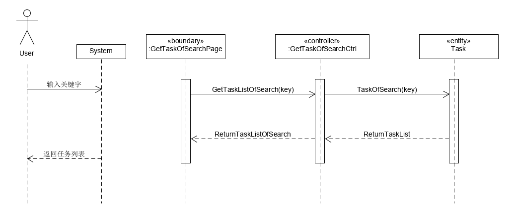
###### 查看任务详细信息
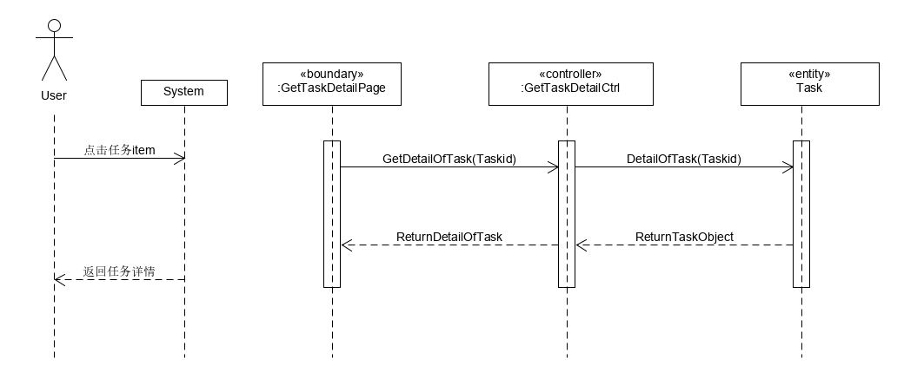
###### 领取任务
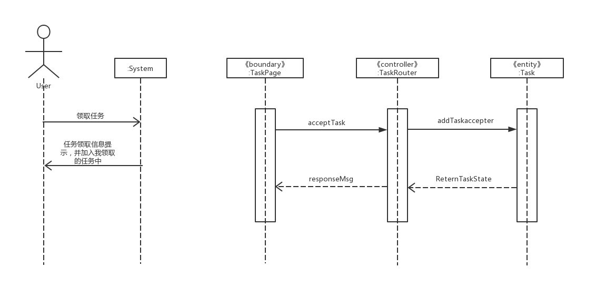
###### 完成任务（提交验证信息）
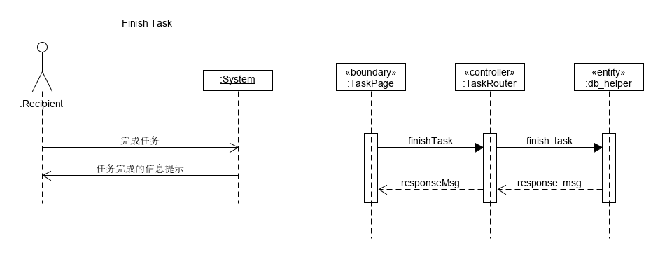
###### 查看与统计问卷详情
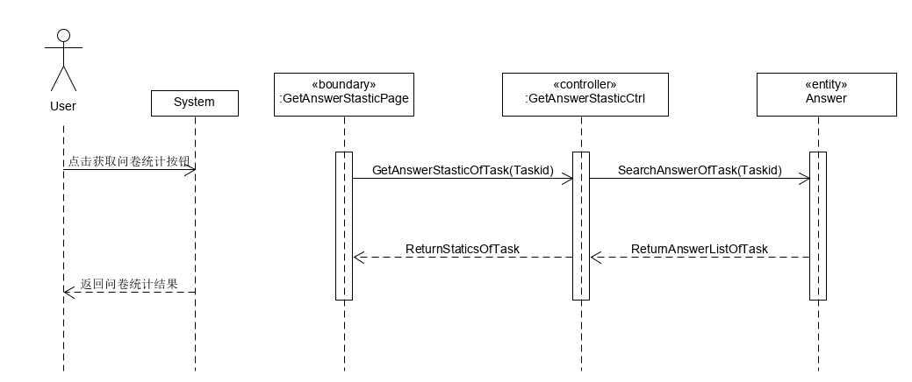

### 2.3、用户特点

本闲鱼翻身系统的最终用户为熟悉微信客户端及微信小程序操作的用户，熟悉发布任务、领取任务、完成任务、移动端支付、以及问卷统计等操作

### 2.4、假定与约束
进行本系统开发的约束条件如下：

#### 时间约束
本系统开发周期为3个月，产品经理需要合理规划时间，前后端开发人员需要跟上布置的任务。
#### 实现约束
- 前端：选择使用微信小程序，一种基于微信的服务形式，使用更方便，而且用户省去安装App的时间，提高用户体验；小程序开发使用WePY框架，能够组件化、单文件开发。

- 后端框架：基于技术和业务规模以及开发周期的考虑，决定使用Flask作为后端开发框架以及MySQL作为数据库服务。
#### 法律约束
- 小程序的运行由微信授权，相关法律问题遵循小程序运行平台的管理要求的规范。
- 接受任务的用户在完成任务之后，应该及时与平台或者发布者进行对接，不可以恶意拖延，不可以隐瞒欺骗。
- 用户可以在本平台上自主选择愿意领取的任务，不允许强制捆绑任务的功能。
- 本平台保证不存在中间商赚差价，价格计算不虚假，欺瞒用户。方面不会出现计量失误。
- 用户在符合要求的情况下，可以申请取消已领取的任务。
- 对于订单的详情，本平台会予以详细准确永久性不可篡改的记录。

## 3、需求规定
### 3.1、对功能的规定

**主成功场景（基本流程）**： 
    
1. 学生对小程序进行授权，正确输入邮箱密码，进入小程序。
2. 学生对小程序进行注册，输入对应的注册信息，完成注册后自动登录跳转到主界面。
3. 学生选择主界面中的任务，点击可查看详情，选择自己喜欢或者乐意完成的任务。
4. 学生完成任务，任务类型为问卷，在点击详情时，可直接看到问卷信息，领取任务需同时提交问卷答案；完成问卷，获得对应的报酬奖励。
5. 学生完成任务，任务类型为取快递或其他时，点击详情，可直接看到任务信息，领取任务，在规定时间内完成任务后上传任务完成凭证，完成任务，获得对应的报酬。
6. 学生完成任务，在我界面中可看到自己完成任务和发布任务的情况。
7. 学生在我界面中，查看和修改个人信息。
8. 学生搜索，输入对应的关键字可进行搜索。
9. 学生发布其他与取快递任务，输入完整相对应的信息，发布成功。
10. 学生发布问卷任务，输入对应的问卷问题，发布成功。

**扩展（其他场景）**

1. 1a. 学生/组织未授权
    * 学生/组织未进行授权登录无法进入到主界面
2. 1b. 学生/组织已登录或注册
    * 学生/组织登录之后，退出小程序，保存用户的登录状态和登录信息，只要未卸载小程序，下次打开可自动登录。
3. 4a. 学生未按时完成领取的任务 
    * 学生接受任务未按时完成，不给予相对应的报酬，在已过时中可找到对应的任务说明。
4. 4b. 任务名额已满 
    * 学生接受任务，额定人员满员之后，此任务将不再给与接受。
5. 4c. 学生不填写问卷直接领取问卷类型的任务
    * 学生接受问卷任务，只有所有选项都填满之后，才能领取并提交。
6. 4d. 学生完成任务，未提交反馈
    * 学生接受取快递与其他任务，未提交反馈，则不给予相应的报酬。
7. 9a. 学生发布取快递/其他任务，发布信息填写不全
    * 学生重要信息未填写给出相应的提示，并不予发布。
8. 10a. 学生发布问卷任务，信息填写不全
    * 学生重要信息未填写则给出相应得提示，并不予发布，问卷信息中，空项会自动略去。

### 3.2、对性能的规定

本应用为移动端的web应用，需要有较快的加载速度和页面渲染速度。页面上计算的内容不宜过度，以免造成界面卡顿。

#### 3.2.1、精度

- 每个任务的金额是以元为单位，精度也是为元，每个用户的咸鱼币与充值也是如此。
- 任务的截止时间、领取时间以及完成时间是精确到分钟、秒级别的
- 人物的领取人数是整数

#### 3.2.2、时间特性要求

- 响应时间：初始化加载页面（比如下拉刷新以及上拉加载等操作）是在3秒内，以及验证码邮件发送是在5秒内，跳转、修改用户信息、以及发布任务的响应都是在1秒钟之内
- 同步时间：一个用户领取了任务之后就在2秒之内更新任务的表单
- 数据的转化和传送时间：数据的转化需要在1秒之内完成，传送时间需要在2秒之内

#### 3.2.3、灵活性

- 任务的领取是可以取消的，也就是当领单人临时有事可以取消之后让别的人进行领单
- 另外，领单人完成任务之后需要发送验证信息等待发单者确认之后才能够拿到报酬
- 发单者可以随时修改需要的完成任务的人数（当然只能增加不能减少），这个有利于任务的扩展

### 3.3其他专门要求

#### 3.3.1、可维护性
- 尽可能提高功能的响应速度，和数据库的搜索速度，提高用户的体验。用户在网络良好的环境中，99%的情况下，可以顺畅无误地完成所进行的业务流程

#### 3.3.2、可扩展性
- 允许更多的功能在必要时可以被插入到适当的位置中。

#### 3.3.3、易读性
- 任务类型合并——将问卷发布和非问卷任务发布合并至同一个页面中，使功能使用更简单。

#### 3.3.4 可用性

- UI设计简单明确：注重用户使用的便捷性、可读性和可编辑性，通过明确的文字和按钮帮助用户正确的使用程序功能。
- 任务搜索：辅助性功能，用户可以根据自己的喜好，搜索自己感兴趣任务，方便使用
- 性能：
- 同步处理：针对组织账户可能由多人协同管理的情况，我们支持同一账号在不同设备同时处理的情况。

#### 3.3.5、可靠性
- 本系统在数据的获取的过程中，是利用用户的openid作为凭证从数据库中提取数据的，所以可以防止用户在请求过程中，个人信息泄漏的问题。而且不同类型的账号，拥有不同程度的权限登记。权限管控机制限制所有用户的可访问内容，确保用户只能狗获取到与自己相关的数据。

#### 3.3.6、安全性
- 所有的个人用户都通过实名认证，组织用户都交与系统核查，保证了用户安全性

#### 3.3.7、可适应性
- 在软件实现时同时考虑到安卓和 iOS系统的适配，保证两者在用户体验上一致

#### 3.3.8、故障处理
— 有错误发生时，后台会返回错误id，以识别错误类型

## 4、运行环境

### 4.1、设备
闲鱼翻身系统需运行在智能触屏手机

### 4.2、支持软件
闲鱼翻身系统需要运行在微信小程序上，以及微信的版本需要7.0.0以上